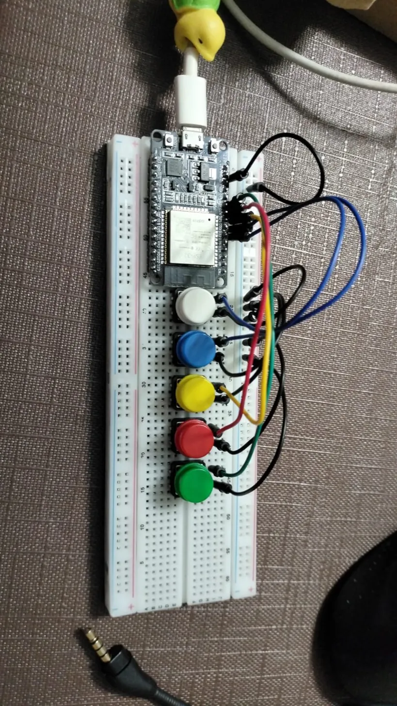

# ESP32 Chord Keyboard – Teclado Bluetooth por Acordes

Un teclado inalámbrico Bluetooth HID construido con ESP32 que permite escribir cualquier letra del alfabeto presionando combinaciones de 5 botones físicos, como si fuera un sistema de acordes. Se empareja con cualquier dispositivo (PC, teléfono, tablet) como si fuera un teclado estándar, sin necesidad de drivers ni software adicional.

---

## ¿Qué problema resuelve?

Los teclados convencionales requieren 26+ teclas para escribir el alfabeto. Este proyecto demuestra que con solo **5 botones** y un sistema de codificación binaria es posible representar todos los caracteres del inglés, puntuación básica, retroceso y Enter — usando combinaciones simultáneas de botones (acordes), similar al código Braille o a los teclados de estenografía.

**Casos de uso:**
- Control remoto Bluetooth para pasar diapositivas
- Dispositivo de entrada accesible de una sola mano
- Proyecto educativo de codificación binaria y HID Bluetooth
- Prototipo portátil con batería LiPo

**Alcance:** El proyecto cubre el firmware del microcontrolador. No incluye una aplicación de escritorio ni app móvil — toda la comunicación es vía Bluetooth HID estándar del sistema operativo.

---

## ¿Cómo funciona internamente?

### Arquitectura general

El sistema tiene tres etapas principales:

```
[Botones físicos] → [Lógica de acorde en ESP32] → [Bluetooth HID] → [Dispositivo receptor]
```

1. **Detección de presión:** el ESP32 lee 5 pines GPIO con pull-up interno. Un botón presionado lee `LOW`.
2. **Ventana de debounce:** al detectar cualquier botón, espera 200 ms para capturar todos los botones presionados simultáneamente (acorde completo).
3. **Patrón binario:** los 5 estados (presionado/suelto) se combinan en un entero de 5 bits (`0b10110`, etc.).
4. **Mapeo a carácter:** un `switch/case` traduce el patrón al carácter correspondiente.
5. **Envío HID:** el carácter se transmite por Bluetooth como pulsación de teclado.

### Estructura del proyecto

```
esp32-chord-keyboard/
├── PIA.ino          # Firmware principal (único archivo fuente)
└── README.md        # Este archivo
```

> Al ser un sketch de Arduino, no hay carpetas adicionales. Toda la lógica reside en `PIA.ino`.

### Tecnologías usadas

| Componente | Detalle |
|---|---|
| Microcontrolador | ESP32 WROOM-32 |
| Framework | Arduino (via Arduino IDE o PlatformIO) |
| Biblioteca principal | `ESP32 BLE Keyboard` by T-vK |
| Protocolo | Bluetooth Low Energy – HID (Human Interface Device) |
| Lenguaje | C++ (Arduino flavor) |

### Mapa de pines

| Color del botón | GPIO | Bit en el patrón |
|---|---|---|
| Blanco | 32 | bit 4 (MSB) |
| Azul | 33 | bit 3 |
| Amarillo | 25 | bit 2 |
| Rojo | 26 | bit 1 |
| Verde | 27 | bit 0 (LSB) |

Todos los botones comparten un pin a GND. El ESP32 usa `INPUT_PULLUP` internamente, por lo que **no se requieren resistencias externas**.

### Tabla de acordes (patrón binario → carácter)

```
10000 → (espacio)   01000 → e   00100 → t   00010 → a   00001 → o
11000 → i           10100 → n   10010 → s   10001 → h   01100 → r
01010 → d           01001 → l   00110 → c   00101 → u   00011 → m
11100 → w           11010 → f   11001 → g   10110 → y   10101 → p
10011 → b           01110 → v   01101 → k   01011 → j   00111 → ⌫
11110 → x           11101 → q   11111 → ↵   10111 → .   11011 → ,
01111 → ?
```

Los caracteres están ordenados por frecuencia de uso en inglés (e, t, a, o, i… los más frecuentes tienen acordes de un solo botón).

### Diagrama de flujo del firmware

```
Inicio
  └─► bleKeyboard.begin()
        └─► loop()
              ├─ ¿Está conectado BT?
              │     └─ No → esperar 1s, reintentar
              ├─ Leer los 5 pines GPIO
              ├─ ¿Algún botón presionado?
              │     └─ No → delay(50), continuar
              ├─ Abrir ventana de 200ms
              │     └─ Acumular todos los botones presionados
              ├─ Construir patrón binario (5 bits)
              ├─ switch(patrón) → carácter
              ├─ bleKeyboard.print(carácter) vía BT
              ├─ Esperar a que se suelten todos los botones
              └─ delay(100) → volver a loop()
```

### Decisiones técnicas

**¿Por qué `INPUT_PULLUP` y no resistencias pull-down externas?**
El ESP32 tiene resistencias pull-up internas (~45 kΩ). Usarlas simplifica el circuito (menos componentes, menos cableado) y es suficiente para botones de corta distancia en protoboard.

**¿Por qué una ventana de tiempo en lugar de detectar la primera pulsación?**
Con una ventana de 200 ms el firmware espera a que el usuario termine de presionar todos los botones del acorde antes de interpretar el resultado. Sin esta ventana, presionar tres botones "simultáneamente" generaría tres caracteres incorrectos antes del correcto.

**¿Por qué los caracteres frecuentes tienen acordes de un solo botón?**
Para reducir la fatiga. Las letras más comunes en inglés (e, t, a, o) requieren solo un dedo, mientras que las menos comunes (x, q) requieren cuatro o cinco dedos.

---

## ¿Cómo se instala y usa?

### Requisitos previos

- **Arduino IDE** 1.8+ o 2.x ([descargar aquí](https://www.arduino.cc/en/software))
- **Soporte para ESP32** en Arduino IDE
- **Biblioteca BLE Keyboard** de T-vK

### Paso 1 – Agregar soporte ESP32 al Arduino IDE

1. Abre Arduino IDE → **Archivo → Preferencias**
2. En *URLs adicionales del gestor de tarjetas*, pega:
   ```
   https://raw.githubusercontent.com/espressif/arduino-esp32/gh-pages/package_esp32_index.json
   ```
3. Ve a **Herramientas → Gestor de tarjetas**, busca `esp32` e instala el paquete de **Espressif Systems**

### Paso 2 – Instalar la biblioteca BLE Keyboard

**Opción A (manual, recomendada):**
1. Descarga el repositorio: [https://github.com/T-vK/ESP32-BLE-Keyboard](https://github.com/T-vK/ESP32-BLE-Keyboard)
2. En Arduino IDE: **Programa → Incluir Biblioteca → Añadir biblioteca .ZIP**
3. Selecciona el archivo descargado

**Opción B (gestor de bibliotecas):**
1. **Herramientas → Administrar bibliotecas**
2. Busca `ESP32 BLE Keyboard` e instala

### Paso 3 – Configurar la placa

En Arduino IDE:
- **Herramientas → Placa → ESP32 Arduino → ESP32 Dev Module**
- **Herramientas → Puerto** → selecciona el puerto COM de tu ESP32
- **Herramientas → Upload Speed** → `115200`

### Paso 4 – Subir el firmware

1. Abre `PIA.ino` en Arduino IDE
2. Haz clic en **Subir** (→)
3. Si aparece `Connecting...`, presiona el botón **BOOT** del ESP32 hasta que empiece a subir

### Paso 5 – Conectar por Bluetooth

1. En tu PC/teléfono, abre **Configuración → Bluetooth**
2. Busca y empareja el dispositivo llamado **`ESP32 Keyboard`**
3. Abre el Monitor Serie en Arduino IDE (9600 baudios) para depurar
4. Presiona combinaciones de botones — verás los caracteres aparecer donde tengas el cursor

### Cableado del circuito

Cada botón se conecta de la siguiente forma:

```
        GPIO XX ──────── [pin 1 del botón]
                         [pin 2 del botón] ──── GND
```

No se requiere ningún componente adicional. El pin de GND de cada botón puede ir a cualquier pin GND disponible en el ESP32 o al rail GND de la protoboard.

---

## ¿Cómo se usa el Monitor Serie (depuración)?

Este proyecto no tiene servidor ni suite de tests automatizados — la verificación se hace en tiempo real a través del Monitor Serie de Arduino IDE, que actúa como la herramienta de depuración principal.

### Abrir el Monitor Serie

1. Con el ESP32 conectado por USB, sube el firmware
2. Ve a **Herramientas → Monitor Serie** (o `Ctrl+Shift+M`)
3. Configura la velocidad en **9600 baudios** (esquina inferior derecha)

### Mensajes esperados

Al encender el ESP32:
```
Bluetooth Keyboard is ready to pair
Waiting for connection...
```

Mientras espera conexión Bluetooth:
```
Keyboard not connected - waiting...
Keyboard not connected - waiting...
```

Una vez emparejado y al presionar botones:
```
Pattern (binary): 10100
Pattern (decimal): 20
Sending: n
```

### Cómo verificar que un acorde funciona correctamente

1. Abre el Monitor Serie
2. Presiona la combinación de botones que quieres probar
3. Confirma que el campo `Pattern (binary)` muestra el patrón esperado
4. Confirma que `Sending:` muestra el carácter correcto
5. Abre un editor de texto en tu PC y verifica que el carácter aparece

Si el patrón es correcto pero el carácter no aparece en el editor, el problema es de conexión Bluetooth. Si el patrón está mal (bits faltantes o extras), el problema es de debounce o cableado.

### Tabla de patrones para verificar cada botón individualmente

Presiona un solo botón a la vez para confirmar que cada GPIO responde:

| Botón | Patrón esperado | Decimal |
|---|---|---|
| Solo Blanco (GPIO 32) | `10000` | 16 |
| Solo Azul (GPIO 33) | `01000` | 8 |
| Solo Amarillo (GPIO 25) | `00100` | 4 |
| Solo Rojo (GPIO 26) | `00010` | 2 |
| Solo Verde (GPIO 27) | `00001` | 1 |

---

## ¿Cómo contribuir?

### Clonar el repositorio

#### Clonar por `HTTPS`
```bash
git clone https://github.com/AJaureguiChio/ESP32-Chord-Keyboard.git
cd esp32-chord-keyboard
```

#### Clonar por `SSH`
```bash
git clone git@github.com:AJaureguiChio/ESP32-Chord-Keyboard.git
cd esp32-chord-keyboard
```

### Flujo de trabajo recomendado

```bash
# Crea una rama para tu mejora
git checkout -b feature/nombre-de-la-mejora

# Haz tus cambios en PIA.ino
# Sube el firmware al ESP32 y prueba con el Monitor Serie
# Una vez verificado, haz commit

git add PIA.ino
git commit -m "feat: descripción breve del cambio"
git push origin feature/nombre-de-la-mejora
```

Luego abre un **Pull Request** en GitHub describiendo qué cambiaste y cómo lo probaste.

### Ideas de mejora abiertas

- **Soporte de mayúsculas** — agregar un botón o combinación que active `KEY_LEFT_SHIFT`
- **Modo número** — una combinación que cambie el mapa de acordes a dígitos del 0-9
- **Soporte de acentos** — caracteres como `á`, `é`, `ñ` para español
- **Modo mouse** — usar el joystick analógico del ESP32 para mover el cursor
- **Batería con indicador** — leer el voltaje del pin ADC para mostrar nivel de batería por Serial
- **Config por Bluetooth** — recibir un mapa de acordes personalizado desde el dispositivo receptor

### Convenciones de commits

```
feat:  nueva funcionalidad
fix:   corrección de bug
docs:  cambios solo en documentación
refactor: cambios en código sin cambiar comportamiento
```

---

## Recursos visuales y técnicos

### Video tutorial de armado e instalación

▶ [https://www.youtube.com/watch?v=hZKu84aT80w](https://www.youtube.com/watch?v=hZKu84aT80w)

### Foto del proyecto armado



### Video del funcionamiento del proyecto

▶ [Evidencia del funcionamiento del Proyecto](https://youtu.be/WjUWCTgEFi4)

### Nombre del dispositivo Bluetooth

Una vez encendido y emparejado, el dispositivo aparece como:
```
ESP32 Keyboard
```

---

## FAQ – Preguntas frecuentes

**¿El teclado funciona en cualquier dispositivo?**
Sí. Al usar el protocolo HID estándar de Bluetooth, es compatible con Windows, macOS, Linux, Android e iOS sin instalar drivers.

**Solo escribe minúsculas, ¿cómo escribo mayúsculas?**
El firmware actual solo envía caracteres en minúscula. Para añadir mayúsculas se puede agregar un botón extra que active `KEY_LEFT_SHIFT` con `bleKeyboard.press()` / `bleKeyboard.release()`.

**El dispositivo no aparece en la lista Bluetooth**
Verifica que el LED del ESP32 esté encendido (hay firmware corriendo), abre el Monitor Serie y confirma que imprime `"Bluetooth Keyboard is ready to pair"`. Si no aparece, revisa que la biblioteca esté correctamente instalada.

**Se empareja pero no escribe nada**
Confirma que el cursor está posicionado en un campo de texto antes de presionar los botones. También verifica en el Monitor Serie que los patrones se detectan correctamente.

**¿Puedo cambiar la asignación de caracteres?**
Sí. En `PIA.ino`, edita el bloque `switch (pattern)` para reasignar cualquier combinación de 5 bits a cualquier carácter o tecla especial de la biblioteca `BleKeyboard`.

**¿Funciona con batería?**
Sí. Conecta una batería LiPo de 3.7V al pin `VIN` y `GND` del ESP32. La placa incluye regulador de voltaje. Se recomienda una batería de al menos 500 mAh para uso prolongado.

**¿Por qué la letra `z` no está en el mapa?**
El alfabeto tiene 26 letras pero con 5 bits solo hay 31 combinaciones válidas (se excluye `00000` porque significa "ningún botón presionado"). Las 31 posiciones se usan para 26 letras + espacio + Enter + Backspace + punto + coma + signo de interrogación. La `z` se puede añadir reemplazando algún carácter menos usado.
